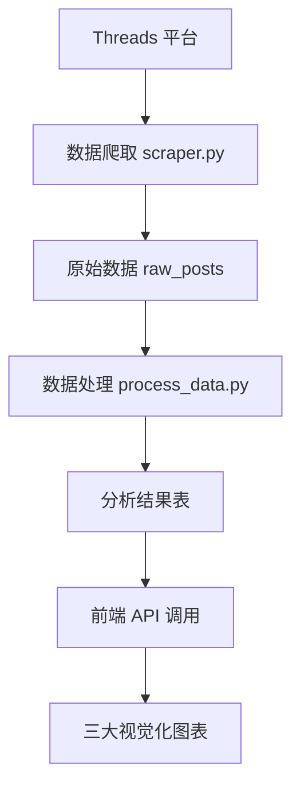

# Threads 趋势仪表板 (Threads Trend Dashboard)


一个高效能的数据仪表板，用于视觉化分析从 Threads 平台上爬取的贴文资料。系统通过直观的图表，揭示热门文章、新兴趋势及关键话题，帮助内容创作者、市场分析师快速洞察社群脉动。

## 🎯 系统特色

### 现代化无服务器架构
- **地端执行环境**: Python 爬虫和数据处理
- **Supabase**: PostgreSQL 数据库 + 自动生成 API  
- **Vercel**: Next.js 前端部署
- **低成本高扩展性**: 按需付费，自动伸缩

### 智能数据分析
- **机器学习聚类**: 自动识别热门话题
- **中文文本处理**: jieba 分词 + 停用词过滤
- **情感分析**: NLTK VADER 情感分析器
- **趋势预测**: 基于动量的热度预测

### 三大核心视觉化
1. **热度气泡图**: 气泡大小 = 互动数，颜色 = 热度密度
2. **趋势河流图**: 关键词时间序列流动图
3. **主题矩阵树图**: 话题分布层次结构图

## 🛠️ 技术栈

### 后端 (Python)
```
├── 数据爬取: selenium + requests + beautifulsoup4
├── 数据处理: pandas + numpy + scikit-learn
├── 中文处理: jieba + nltk
├── 数据库: supabase-py
└── 测试: pytest + pytest-mock
```

### 前端 (Next.js + TypeScript)
```
├── 框架: Next.js 15 + TypeScript + Tailwind CSS
├── 视觉化: D3.js + Framer Motion
├── UI组件: Lucide React
└── 状态管理: React Hooks
```

### 数据库 (Supabase PostgreSQL)
```
├── 原始数据表: raw_posts
├── 分析结果表: processed_post_metrics, processed_topic_summary
├── 趋势数据表: processed_keyword_trends
└── 关联表: post_topic_relations, user_activity_stats
```

## 📁 项目结构

```
threads_auto_scraper/
├── 📁 frontend-app/                 # Next.js 前端应用
│   ├── src/
│   │   ├── app/                     # App Router
│   │   ├── components/              # React 组件
│   │   │   ├── charts/              # 三大图表组件
│   │   │   │   ├── HeatBubbleChart.tsx
│   │   │   │   ├── TrendRiverChart.tsx
│   │   │   │   └── TopicTreemap.tsx
│   │   │   ├── ui/                  # UI 组件
│   │   │   └── Dashboard.tsx        # 主仪表板
│   │   └── mock-data.json           # 测试数据
│   └── package.json
├── 📁 backend/                      # Python 后端
│   ├── scraper.py                   # 数据爬取脚本
│   ├── database.py                  # Supabase 数据库管理
│   ├── process_data.py              # 数据分析处理
│   ├── test_scraper.py              # 爬虫单元测试
│   ├── test_database_integration.py # 数据库集成测试
│   └── requirements.txt             # Python 依赖
├── database_schema.sql              # 数据库架构
├── accounts.json                    # 目标用户列表
├── .env.example                     # 环境变数模板
└── README.md                        # 项目文档
```

## 🚀 快速开始

### 1. 环境准备

```bash
# 克隆项目
git clone <repository-url>
cd threads_auto_scraper

# Python 环境
pip install -r requirements.txt

# 前端依赖
cd frontend-app
npm install
```

### 2. 环境配置

复制 `.env.example` 为 `.env` 并配置：

```env
# Supabase 配置
SUPABASE_URL=your_supabase_project_url
SUPABASE_KEY=your_supabase_anon_key

# 爬虫配置  
THREADS_BASE_URL=https://www.threads.com
SCRAPER_DELAY_MIN=2
SCRAPER_DELAY_MAX=5
SCRAPER_TIMEOUT=30
```

### 3. 数据库设置

在 Supabase 控制台执行 `database_schema.sql` 创建表结构。

### 4. 运行系统

```bash
# 启动数据爬取
python scraper.py

# 运行数据处理  
python process_data.py

# 启动前端 (开发模式)
cd frontend-app
npm run dev
```

访问 http://localhost:3000 查看仪表板。

## 📊 核心功能详解

### 热度气泡图 (Heat Bubble Chart)
- **气泡大小**: 总互动数 (点赞 + 回复 + 转发)
- **气泡颜色**: 热度密度 (考虑时间衰减)
- **位置分布**: 力导向布局，避免重叠
- **交互功能**: 悬停详情、点击跳转原贴

**核心算法**:
```python
heat_density = (
    base_heat * time_decay * (1 + length_factor)
)
time_decay = np.exp(-decay_rate * hours_since_post / 24)
```

### 趋势河流图 (Trend River Chart)  
- **河流宽度**: 关键词在该时间的提及数
- **河流流向**: 时间轴上的趋势变化
- **颜色区分**: 不同关键词使用不同颜色
- **动量分析**: 基于变化率的趋势预测

**核心算法**:
```python
momentum_score = (values[-1] - values[0]) / (len(values) - 1)
```

### 主题矩阵树图 (Topic Treemap)
- **矩形大小**: 主题的总互动数量
- **颜色深浅**: 不同主题类别
- **情感指示**: 右上角圆点显示情感倾向
- **趋势箭头**: 显示主题发展方向

**核心算法**:
```python
# K-means 聚类分析
kmeans = KMeans(n_clusters=n_clusters, random_state=42)
cluster_labels = kmeans.fit_predict(tfidf_matrix)
```

## 🧪 测试系统

### 运行所有测试
```bash
# Python 测试
pytest test_scraper.py -v
pytest test_database_integration.py -v

# 前端测试 (需要配置)
cd frontend-app  
npm test
```

### 测试覆盖率
- **爬虫功能**: 单元测试 + 集成测试
- **数据处理**: 算法测试 + 性能测试  
- **前端组件**: 视觉回归测试
- **API接口**: 端到端测试

## 📈 数据流程



### 数据处理流程
1. **数据采集**: 爬取用户贴文和互动数据
2. **数据清洗**: 去重、格式化、异常处理
3. **特征工程**: 计算热度密度、新鲜度分数
4. **文本分析**: 中文分词、关键词提取
5. **聚类分析**: K-means 主题聚类
6. **趋势分析**: 时间序列动量计算
7. **结果存储**: 分析结果存入对应表格

## 🎨 UI/UX 设计

### 设计原则
- **简洁直观**: 清晰的视觉层次
- **响应式**: 支持桌面、平板、手机
- **交互丰富**: 悬停、点击、动画效果
- **性能优化**: 懒加载、虚拟化

### 动画效果
- **页面进入**: Framer Motion 渐入动画
- **图表绘制**: D3.js 渐进式绘制
- **交互反馈**: 悬停高亮、点击缩放
- **数据更新**: 平滑过渡动画

## 🔧 部署指南

### Vercel 部署 (推荐)
```bash
cd frontend-app
npm run build
vercel --prod
```

### 本地部署
```bash 
# 构建前端
cd frontend-app
npm run build
npm start

# 后台运行数据处理
nohup python process_data.py &
```

### Docker 部署
```dockerfile
FROM node:18-alpine
WORKDIR /app
COPY frontend-app/ .
RUN npm install && npm run build
EXPOSE 3000
CMD ["npm", "start"]
```

## 📝 开发路线图

### v2.1 (规划中)
- [ ] 实时数据更新
- [ ] 用户自定义主题
- [ ] 导出功能 (PDF/PNG)
- [ ] 多语言支持

### v2.2 (未来)
- [ ] AI 聊天机器人
- [ ] 预测分析模型
- [ ] 社交网络分析
- [ ] 移动端 App

## 🤝 贡献指南

1. Fork 本项目
2. 创建功能分支 (`git checkout -b feature/AmazingFeature`)
3. 提交更改 (`git commit -m 'Add some AmazingFeature'`)
4. 推送到分支 (`git push origin feature/AmazingFeature`)
5. 打开 Pull Request

### 开发规范
- Python: PEP 8 + Black 格式化
- TypeScript: ESLint + Prettier
- 测试: 新功能需要对应测试
- 文档: 重要功能需要更新文档

## 📄 许可证

MIT License - 详见 [LICENSE](LICENSE) 文件

## 🙏 致谢

- [Next.js](https://nextjs.org/) - React 框架
- [D3.js](https://d3js.org/) - 数据视觉化
- [Supabase](https://supabase.com/) - Backend-as-a-Service
- [Tailwind CSS](https://tailwindcss.com/) - CSS 框架
- [scikit-learn](https://scikit-learn.org/) - 机器学习库

---

**⭐ 如果觉得这个项目有用，请给个 Star！**

📧 联系方式: [你的邮箱]  
🐛 问题反馈: [GitHub Issues](link-to-issues)  
📖 详细文档: [项目 Wiki](link-to-wiki)